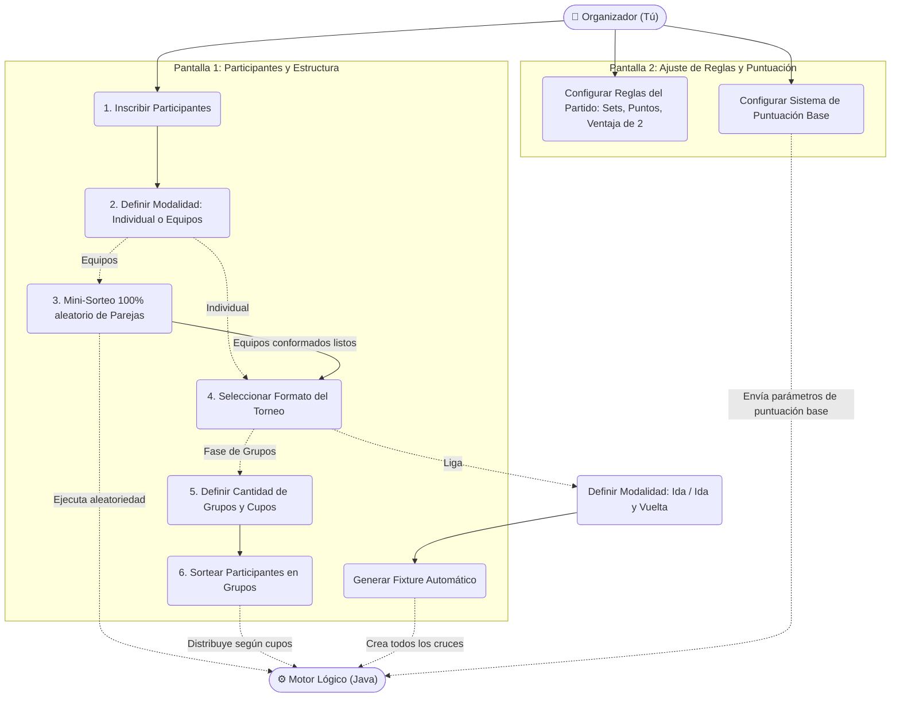

```mermaid
flowchart TD
    %% Actores
    Org(["👤 Organizador (Tú)"])
    Sys(["⚙️ Motor Lógico (Java)"])

    subgraph Pantalla_1 ["Pantalla 1: Participantes y Estructura"]
        direction TB
        
        P1(1. Inscribir Participantes)
        P2(2. Definir Modalidad: Individual o Equipos)
        P3(3. Mini-Sorteo de Parejas)
        P4(4. Seleccionar Formato del Torneo)
        
        P5(5. Definir Cantidad de Grupos y Cupos)
        P6(6. Sortear Participantes en Grupos)
        
        P7(Generar Fixture Automático)
    end

    subgraph Pantalla_2 ["Pantalla 2: Ajuste de Reglas y Puntuación"]
        direction TB
        R2(Configurar Reglas del Partido: Sets, Puntos, Ventaja de 2)
        R3(Configurar Sistema de Puntuación Base)
    end

    %% Flujo Cronológico del Organizador
    Org --> P1
    Org --> R2
    Org --> R3
    
    P1 --> P2
    
    %% Bifurcación: Individual vs Equipos
    P2 -.->|Individual| P4
    P2 -.->|Equipos| P3(3. Mini-Sorteo 100% aleatorio de Parejas)
    P3 -->|Equipos conformados listos| P4
    
    %% Bifurcación: Grupos vs Liga
    P4 -.->|Fase de Grupos| P5
    P5 --> P6
    P4 -.->|Liga| P_Ida(Definir Modalidad: Ida / Ida y Vuelta)
    P_Ida --> P7

    %% Conexiones con el Sistema (Backend Java)
    P3 -.->|Ejecuta aleatoriedad| Sys
    P6 -.->|Distribuye según cupos| Sys
    P7 -.->|Crea todos los cruces| Sys
    R3 -.->|Envía parámetros de puntuación base| Sys
```