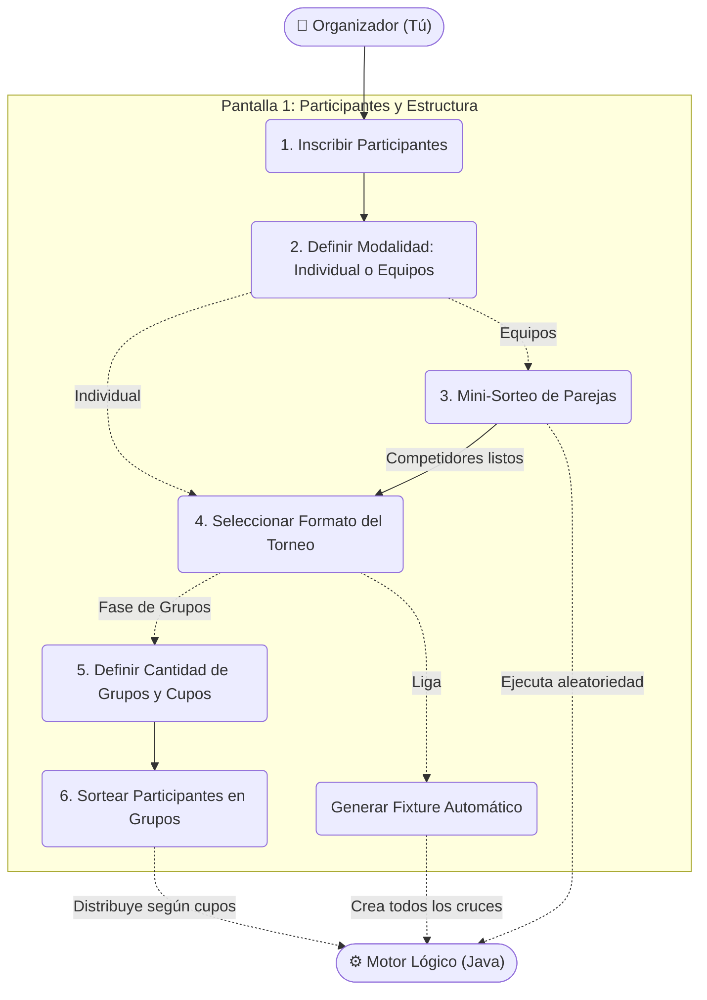

```mermaid
flowchart TD
    %% Actor
    Org(["👤 Organizador (Tú)"])

    subgraph Pantalla_2 ["Pantalla 2: Ajuste de Reglas"]
        direction TB
        
        R1(Configurar Modalidad de Cruces: Ida / Ida y Vuelta)
        R2(Configurar Reglas del Partido: Sets, Puntos, Ventaja de 2)
    end

    %% Acciones Independientes
    Org --> R1
    Org --> R2