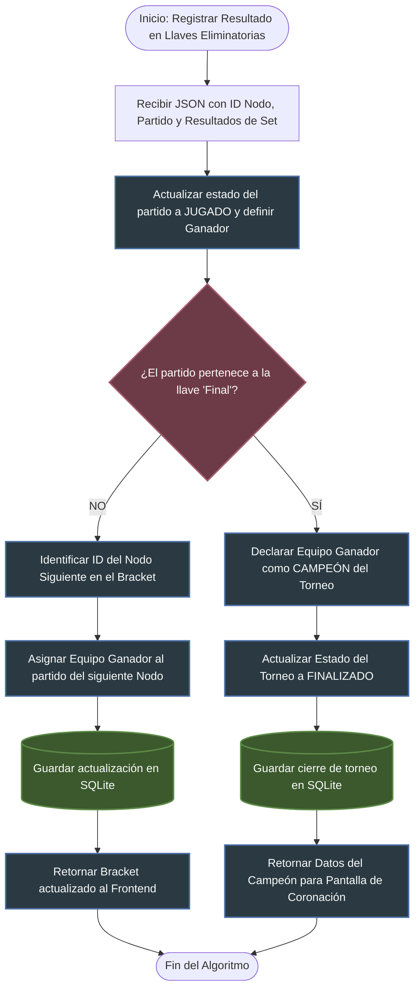

```mermaid
flowchart TD
    %% Inicio del Algoritmo
    Start([Inicio: Registrar Resultado en Llaves Eliminatorias]) --> RecibirPayload[Recibir JSON con ID Nodo, Partido y Resultados de Set]
    
    %% Procesamiento del Partido
    RecibirPayload --> ProcesarPartido[Actualizar estado del partido a JUGADO y definir Ganador]
    
    %% Validación de la Instancia Actual
    ProcesarPartido --> EvaluarInstancia{¿El partido pertenece a la llave 'Final'?}
    
    %% Flujo Regular de Eliminatoria
    EvaluarInstancia -->|NO| AvanzarBracket[Identificar ID del Nodo Siguiente en el Bracket]
    AvanzarBracket --> AsignarClasificado[Asignar Equipo Ganador al partido del siguiente Nodo]
    AsignarClasificado --> TransaccionDB_A[(Guardar actualización en SQLite)]
    TransaccionDB_A --> RetornarArbol[Retornar Bracket actualizado al Frontend]
    RetornarArbol --> Fin([Fin del Algoritmo])
    
    %% Flujo de Cierre de Torneo
    EvaluarInstancia -->|SÍ| DeclararCampeon[Declarar Equipo Ganador como CAMPEÓN del Torneo]
    DeclararCampeon --> CerrarTorneo[Actualizar Estado del Torneo a FINALIZADO]
    CerrarTorneo --> TransaccionDB_B[(Guardar cierre de torneo en SQLite)]
    TransaccionDB_B --> RetornarCampeon[Retornar Datos del Campeón para Pantalla de Coronación]
    RetornarCampeon --> Fin
    
    %% Estilos
    classDef logica fill:#2b3a42,stroke:#4a6fa5,stroke-width:2px,color:#fff;
    classDef decision fill:#6d3b47,stroke:#a55c6e,stroke-width:2px,color:#fff;
    classDef bd fill:#3b592d,stroke:#5c8a46,stroke-width:2px,color:#fff;
    
    class EvaluarInstancia decision;
    class ProcesarPartido,AvanzarBracket,AsignarClasificado,DeclararCampeon,CerrarTorneo,RetornarArbol,RetornarCampeon logica;
    class TransaccionDB_A,TransaccionDB_B bd;
```
