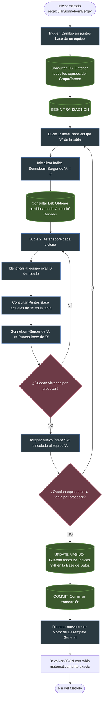

```mermaid
flowchart TD
    %% Inicio del Método
    Start([Inicio: método recalcularSonnebornBerger]) --> RecibirEvento[Trigger: Cambio en puntos base de un equipo]
    
    %% Obtención de Datos
    RecibirEvento --> ObtenerTabla[(Consultar DB: Obtener todos los equipos del Grupo/Torneo)]
    ObtenerTabla --> IniciarTransaccion[(BEGIN TRANSACTION)]
    
    %% Bucle Principal: Todos los equipos
    IniciarTransaccion --> BucleEquipos[Bucle 1: Iterar cada equipo 'A' de la tabla]
    BucleEquipos --> ResetSuma[Inicializar índice Sonneborn-Berger de 'A' = 0]
    
    %% Bucle Secundario: Rivales vencidos
    ResetSuma --> BuscarVictorias[(Consultar DB: Obtener partidos donde 'A' resultó Ganador)]
    BuscarVictorias --> BucleVictorias[Bucle 2: Iterar sobre cada victoria]
    
    BucleVictorias --> ExtraerRival[Identificar al equipo rival 'B' derrotado]
    ExtraerRival --> ObtenerPuntosRival[Consultar Puntos Base actuales de 'B' en la tabla]
    ObtenerPuntosRival --> SumarAlIndice[Sonneborn-Berger de 'A' += Puntos Base de 'B']
    
    SumarAlIndice --> FinBucleVictorias{¿Quedan victorias por procesar?}
    FinBucleVictorias -->|SÍ| BucleVictorias
    
    %% Guardado Temporal y Avance
    FinBucleVictorias -->|NO| GuardarTemporal[Asignar nuevo índice S-B calculado al equipo 'A']
    GuardarTemporal --> FinBucleEquipos{¿Quedan equipos en la tabla por procesar?}
    FinBucleEquipos -->|SÍ| BucleEquipos
    
    %% Persistencia final (Cascada completa)
    FinBucleEquipos -->|NO| ActualizarDB[(UPDATE MASIVO: Guardar todos los índices S-B en la Base de Datos)]
    ActualizarDB --> CommitDB[(COMMIT: Confirmar transacción)]
    
    CommitDB --> MotorDesempate[Disparar nuevamente Motor de Desempate General]
    MotorDesempate --> RetornarJSON[Devolver JSON con tabla matemáticamente exacta]
    RetornarJSON --> Fin([Fin del Método])
    
    %% Estilos
    classDef logica fill:#2b3a42,stroke:#4a6fa5,stroke-width:2px,color:#fff;
    classDef decision fill:#6d3b47,stroke:#a55c6e,stroke-width:2px,color:#fff;
    classDef bd fill:#3b592d,stroke:#5c8a46,stroke-width:2px,color:#fff;
    
    class FinBucleVictorias,FinBucleEquipos decision;
    class RecibirEvento,BucleEquipos,ResetSuma,BucleVictorias,ExtraerRival,ObtenerPuntosRival,SumarAlIndice,GuardarTemporal,MotorDesempate logica;
    class ObtenerTabla,IniciarTransaccion,BuscarVictorias,ActualizarDB,CommitDB bd;
```
