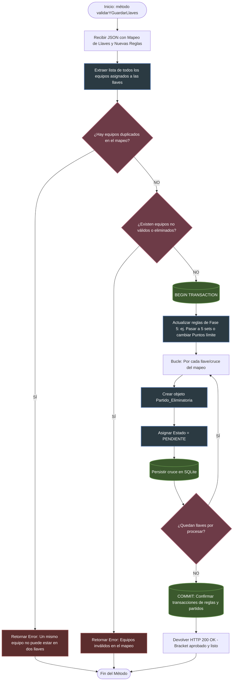

```mermaid
flowchart TD
    %% Inicio del Método
    Start([Inicio: método validarYGuardarLlaves]) --> RecibirPayload[Recibir JSON con Mapeo de Llaves y Nuevas Reglas]
    
    %% Desestructuración
    RecibirPayload --> ExtraerEquipos[Extraer lista de todos los equipos asignados a las llaves]
    ExtraerEquipos --> ValidarDuplicados{¿Hay equipos duplicados en el mapeo?}
    
    %% Validación de Integridad
    ValidarDuplicados -->|SÍ| Error1[Retornar Error: Un mismo equipo no puede estar en dos llaves] --> Fin([Fin del Método])
    ValidarDuplicados -->|NO| ValidarInexistentes{¿Existen equipos no válidos o eliminados?}
    
    ValidarInexistentes -->|SÍ| Error2[Retornar Error: Equipos inválidos en el mapeo] --> Fin
    ValidarInexistentes -->|NO| IniciarTransaccion[(BEGIN TRANSACTION)]
    
    %% Configuración de Nuevas Reglas
    IniciarTransaccion --> InyectarReglas[Actualizar reglas de Fase 5: ej. Pasar a 5 sets o cambiar Puntos límite]
    
    %% Bucle de Creación de Partidos
    InyectarReglas --> BucleLlaves[Bucle: Por cada llave/cruce del mapeo]
    BucleLlaves --> CrearPartido[Crear objeto Partido_Eliminatoria]
    CrearPartido --> AsignarEstado[Asignar Estado = PENDIENTE]
    AsignarEstado --> GuardarPartido[(Persistir cruce en SQLite)]
    
    GuardarPartido --> FinBucle{¿Quedan llaves por procesar?}
    FinBucle -->|SÍ| BucleLlaves
    
    %% Cierre y Retorno
    FinBucle -->|NO| ConfirmarTransaccion[(COMMIT: Confirmar transacciones de reglas y partidos)]
    ConfirmarTransaccion --> RetornarJSON[Devolver HTTP 200 OK - Bracket aprobado y listo]
    RetornarJSON --> Fin
    
    %% Estilos
    classDef logica fill:#2b3a42,stroke:#4a6fa5,stroke-width:2px,color:#fff;
    classDef decision fill:#6d3b47,stroke:#a55c6e,stroke-width:2px,color:#fff;
    classDef bd fill:#3b592d,stroke:#5c8a46,stroke-width:2px,color:#fff;
    classDef error fill:#5c2d2d,stroke:#8a4646,stroke-width:2px,color:#fff;
    
    class ValidarDuplicados,ValidarInexistentes,FinBucle decision;
    class ExtraerEquipos,InyectarReglas,CrearPartido,AsignarEstado logica;
    class IniciarTransaccion,GuardarPartido,ConfirmarTransaccion bd;
    class Error1,Error2 error;
```
