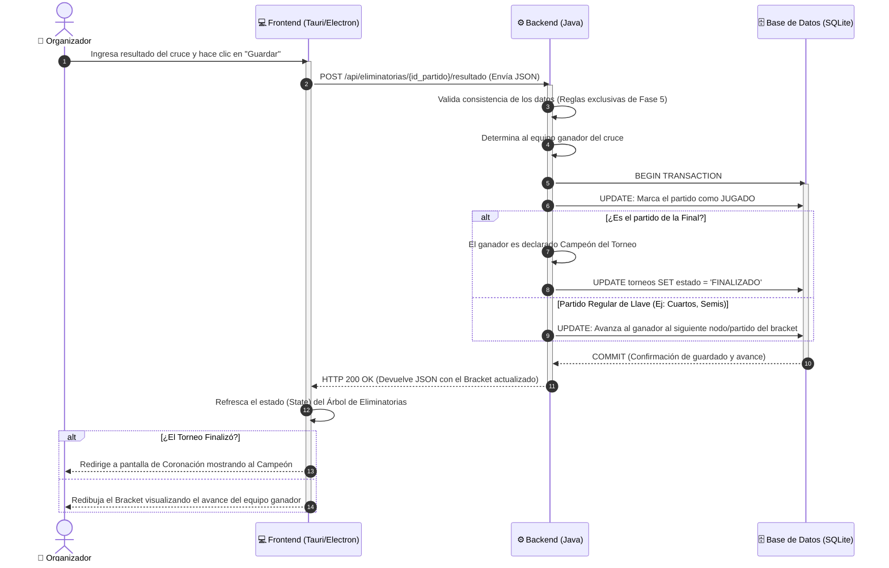

```mermaid
sequenceDiagram
    autonumber
    
    %% Definición de Actores y Componentes
    actor Org as 👤 Organizador
    participant UI as 💻 Frontend (Tauri/Electron)
    participant API as ⚙️ Backend (Java)
    participant DB as 🗄️ Base de Datos (SQLite)

    %% Interacción del Usuario en Playoffs
    Org->>UI: Ingresa resultado del cruce y hace clic en "Guardar"
    activate UI
    
    %% Envío de datos al Backend
    UI->>API: POST /api/eliminatorias/{id_partido}/resultado (Envía JSON)
    activate API
    
    %% Validaciones y Lógica en Java
    API->>API: Valida consistencia de los datos (Reglas exclusivas de Fase 5)
    API->>API: Determina al equipo ganador del cruce
    
    %% Transacción con la Base de Datos
    API->>DB: BEGIN TRANSACTION
    activate DB
    API->>DB: UPDATE: Marca el partido como JUGADO
    
    %% Lógica de Avance en el Bracket
    alt ¿Es el partido de la Final?
        API->>API: El ganador es declarado Campeón del Torneo
        API->>DB: UPDATE torneos SET estado = 'FINALIZADO'
    else Partido Regular de Llave (Ej: Cuartos, Semis)
        API->>DB: UPDATE: Avanza al ganador al siguiente nodo/partido del bracket
    end
    
    DB-->>API: COMMIT (Confirmación de guardado y avance)
    deactivate DB
    
    %% Respuesta al Frontend
    API-->>UI: HTTP 200 OK (Devuelve JSON con el Bracket actualizado)
    deactivate API
    
    %% Actualización Visual
    UI->>UI: Refresca el estado (State) del Árbol de Eliminatorias
    
    alt ¿El Torneo Finalizó?
        UI-->>Org: Redirige a pantalla de Coronación mostrando al Campeón
    else 
        UI-->>Org: Redibuja el Bracket visualizando el avance del equipo ganador
    end
    deactivate UI
```
