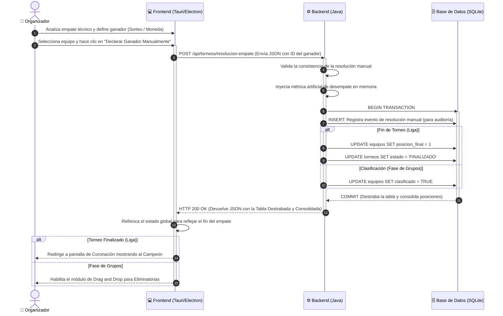

```mermaid
sequenceDiagram
    autonumber
    
    %% Definición de Actores y Componentes
    actor Org as 👤 Organizador
    participant UI as 💻 Frontend (Tauri/Electron)
    participant API as ⚙️ Backend (Java)
    participant DB as 🗄️ Base de Datos (SQLite)

    %% Interacción Inicial ante Alerta
    Org->>UI: Analiza empate técnico y define ganador (Sorteo / Moneda)
    Org->>UI: Selecciona equipo y hace clic en "Declarar Ganador Manualmente"
    activate UI
    
    %% Envío de datos de resolución al Backend
    UI->>API: POST /api/torneos/resolucion-empate (Envía JSON con ID del ganador)
    activate API
    
    %% Validaciones y Lógica en Java
    API->>API: Valida la consistencia de la resolución manual
    API->>API: Inyecta métrica artificial de desempate en memoria
    
    %% Transacción con la Base de Datos
    API->>DB: BEGIN TRANSACTION
    activate DB
    API->>DB: INSERT: Registra evento de resolución manual (para auditoría)
    
    alt Fin de Torneo (Liga)
        API->>DB: UPDATE equipos SET posicion_final = 1
        API->>DB: UPDATE torneos SET estado = 'FINALIZADO'
    else Clasificación (Fase de Grupos)
        API->>DB: UPDATE equipos SET clasificado = TRUE
    end
    
    DB-->>API: COMMIT (Destraba la tabla y consolida posiciones)
    deactivate DB
    
    %% Respuesta al Frontend
    API-->>UI: HTTP 200 OK (Devuelve JSON con la Tabla Destrabada y Consolidada)
    deactivate API
    
    %% Actualización Visual
    UI->>UI: Refresca el estado global para reflejar el fin del empate
    
    alt Torneo Finalizado (Liga)
        UI-->>Org: Redirige a pantalla de Coronación mostrando al Campeón
    else Fase de Grupos
        UI-->>Org: Habilita el módulo de Drag and Drop para Eliminatorias
    end
    deactivate UI
```
