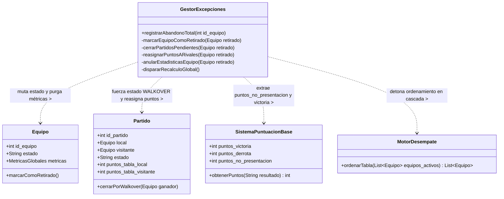

```mermaid
classDiagram
    %% Controlador Principal de Caos
    class GestorExcepciones {
        +registrarAbandonoTotal(int id_equipo)
        -marcarEquipoComoRetirado(Equipo retirado)
        -cerrarPartidosPendientes(Equipo retirado)
        -reasignarPuntosARivales(Equipo retirado)
        -anularEstadisticasEquipo(Equipo retirado)
        -dispararRecalculoGlobal()
    }

    %% Entidades Afectadas
    class Equipo {
        +int id_equipo
        +String estado
        +MetricasGlobales metricas
        +marcarComoRetirado()
    }

    class Partido {
        +int id_partido
        +Equipo local
        +Equipo visitante
        +String estado
        +int puntos_tabla_local
        +int puntos_tabla_visitante
        +cerrarPorWalkover(Equipo ganador)
    }

    %% Servicios de Soporte
    class SistemaPuntuacionBase {
        +int puntos_victoria
        +int puntos_derrota
        +int puntos_no_presentacion
        +obtenerPuntos(String resultado) int
    }

    class MotorDesempate {
        +ordenarTabla(List~Equipo~ equipos_activos) List~Equipo~
    }

    %% Relaciones
    GestorExcepciones ..> Equipo : muta estado y purga métricas >
    GestorExcepciones ..> Partido : fuerza estado WALKOVER y reasigna puntos >
    GestorExcepciones ..> SistemaPuntuacionBase : extrae puntos_no_presentacion y victoria >
    GestorExcepciones ..> MotorDesempate : detona ordenamiento en cascada >
```
