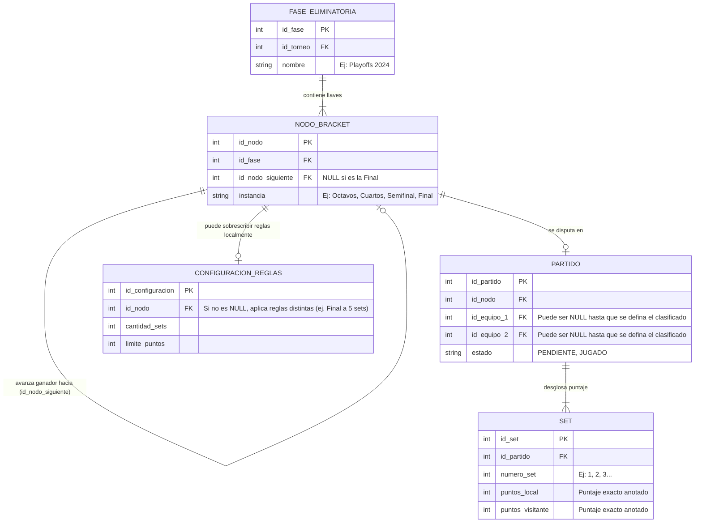

```mermaid
erDiagram
    %% Relaciones de Eliminatorias
    FASE_ELIMINATORIA ||--|{ NODO_BRACKET : "contiene llaves"
    NODO_BRACKET ||--o| NODO_BRACKET : "avanza ganador hacia (id_nodo_siguiente)"
    NODO_BRACKET ||--o| PARTIDO : "se disputa en"
    PARTIDO ||--|{ SET : "desglosa puntaje"
    NODO_BRACKET ||--o| CONFIGURACION_REGLAS : "puede sobrescribir reglas localmente"
    
    %% Entidades
    FASE_ELIMINATORIA {
        int id_fase PK
        int id_torneo FK
        string nombre "Ej: Playoffs 2024"
    }

    NODO_BRACKET {
        int id_nodo PK
        int id_fase FK
        int id_nodo_siguiente FK "NULL si es la Final"
        string instancia "Ej: Octavos, Cuartos, Semifinal, Final"
    }

    PARTIDO {
        int id_partido PK
        int id_nodo FK
        int id_equipo_1 FK "Puede ser NULL hasta que se defina el clasificado"
        int id_equipo_2 FK "Puede ser NULL hasta que se defina el clasificado"
        string estado "PENDIENTE, JUGADO"
    }
    
    CONFIGURACION_REGLAS {
        int id_configuracion PK
        int id_nodo FK "Si no es NULL, aplica reglas distintas (ej. Final a 5 sets)"
        int cantidad_sets
        int limite_puntos
    }

    SET {
        int id_set PK
        int id_partido FK
        int numero_set "Ej: 1, 2, 3..."
        int puntos_local "Puntaje exacto anotado"
        int puntos_visitante "Puntaje exacto anotado"
    }
```
